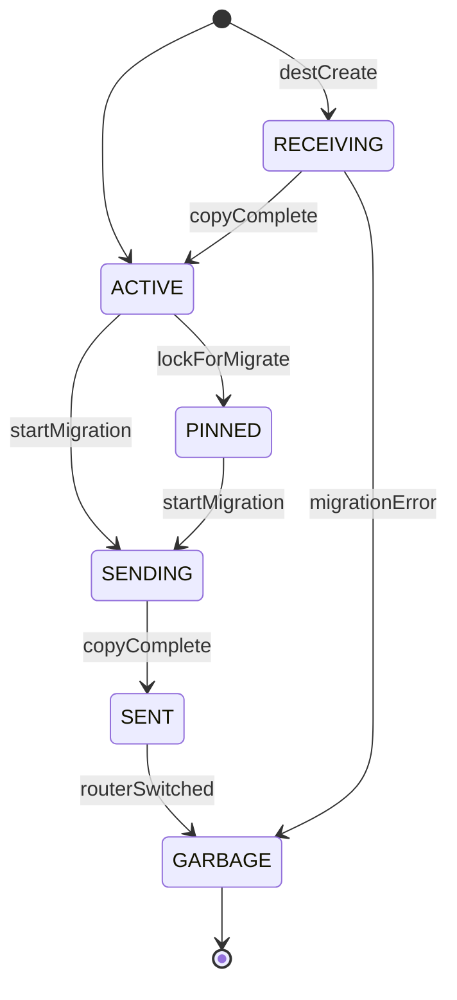

# Template: bucket migration states

```mermaid
stateDiagram-v2
  [*] --> ACTIVE
  ACTIVE --> PINNED: lockForMigrate
  ACTIVE --> SENDING: startMigration
  PINNED --> SENDING: startMigration
  SENDING --> SENT: copyComplete
  SENT --> GARBAGE: routerSwitched
  GARBAGE --> [*]
  [*] --> RECEIVING: destCreate
  RECEIVING --> ACTIVE: copyComplete
  RECEIVING --> GARBAGE: migrationError
```
