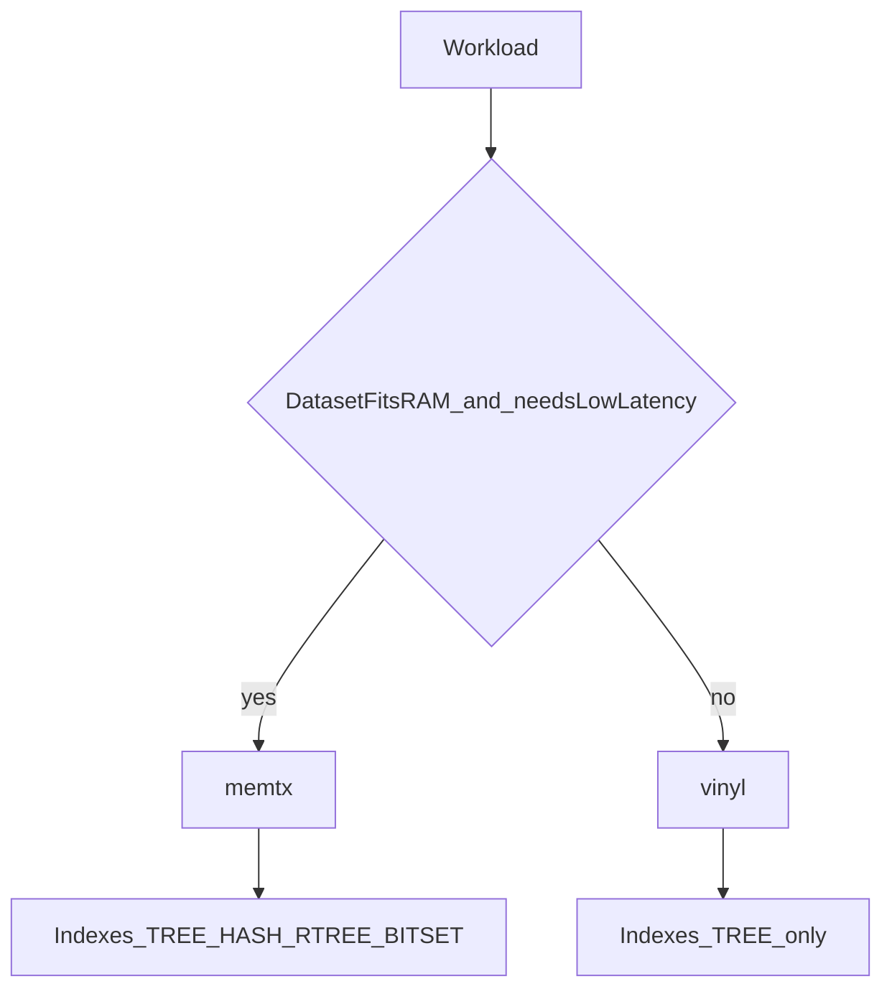

# Template: engine choice overview

```mermaid
flowchart TB
  Workload[Workload] --> FitsRAM{DatasetFitsRAM_and_needsLowLatency}
  FitsRAM -->|yes| Memtx[memtx]
  FitsRAM -->|no| Vinyl[vinyl]
  Memtx --> IdxMemtx[Indexes_TREE_HASH_RTREE_BITSET]
  Vinyl --> IdxVinyl[Indexes_TREE_only]
```
