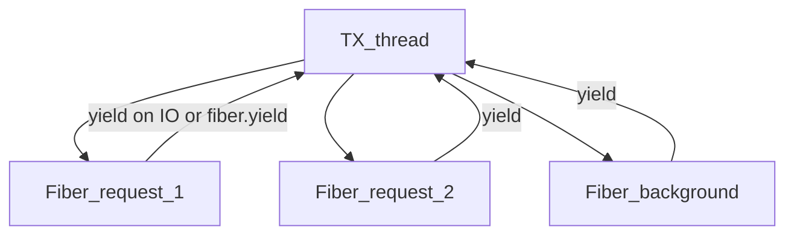

# Template: fibers / cooperative multitasking

```mermaid
flowchart TB
  TX[TX_thread] --> F1[Fiber_request_1]
  TX --> F2[Fiber_request_2]
  TX --> F3[Fiber_background]
  F1 -->|"yield on IO or fiber.yield"| TX
  F2 -->|"yield"| TX
  F3 -->|"yield"| TX
```

Note: fibers are cooperatively scheduled; a fiber that never yields stalls others on the same event loop.
