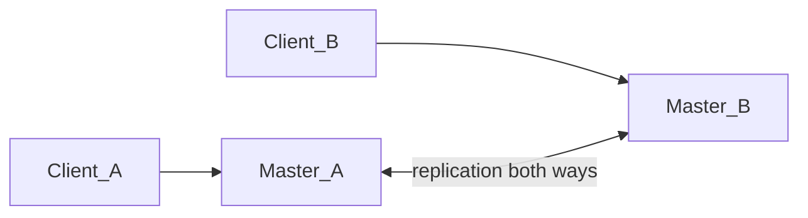

# Template: master-master (use sparingly; document conflict policy)

Notes:

- Prefer single-primary topologies unless the product explicitly needs multi-master.
- Call out conflict resolution (application triggers / last-writer rules) in prose.
