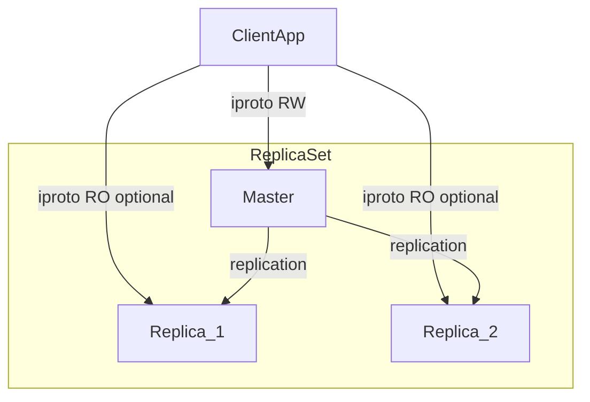

# Template: master + replicas (async replica set)

```mermaid
flowchart TB
  Client[ClientApp] -->|"iproto RW"| Master[Master]
  Client -->|"iproto RO optional"| Replica1[Replica_1]
  Client -->|"iproto RO optional"| Replica2[Replica_2]
  subgraph ReplicaSet[ReplicaSet]
    Master -->|"replication"| Replica1
    Master -->|"replication"| Replica2
  end
```
