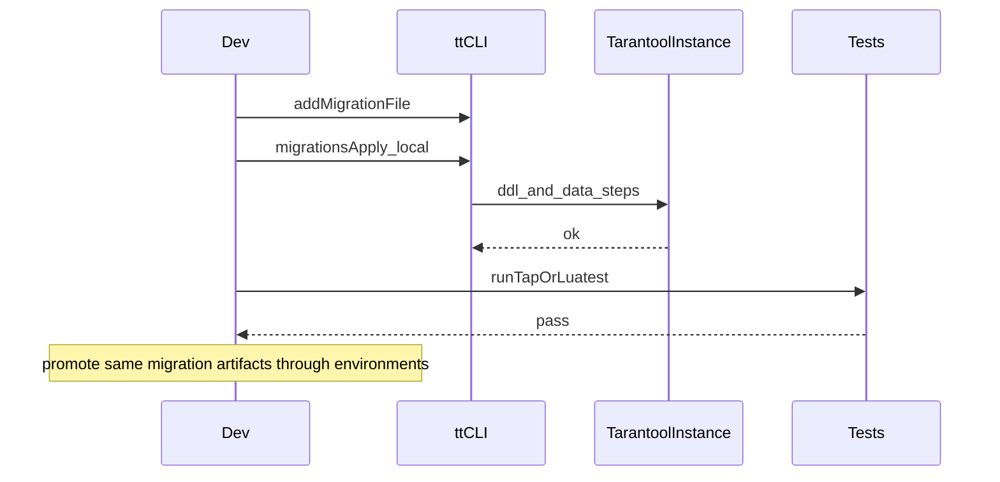

# Template: schema migration sequence (dev/staging oriented)

```mermaid
sequenceDiagram
  participant Dev
  participant tt as ttCLI
  participant Inst as TarantoolInstance
  participant Tests
  Dev->>tt: addMigrationFile
  Dev->>tt: migrationsApply_local
  tt->>Inst: ddl_and_data_steps
  Inst-->>tt: ok
  Dev->>Tests: runTapOrLuatest
  Tests-->>Dev: pass
  Note over Dev: promote same migration artifacts through environments
```
