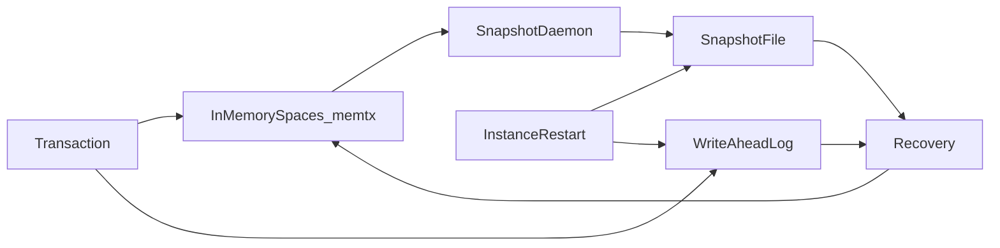

# Template: persistence (WAL + snapshot)

```mermaid
flowchart LR
  Txn[Transaction] --> Mem[InMemorySpaces_memtx]
  Txn --> WAL[WriteAheadLog]
  SnapFiber[SnapshotDaemon] --> Snap[SnapshotFile]
  Mem --> SnapFiber
  Restart[InstanceRestart] --> Snap
  Restart --> WAL
  Snap --> Recover[Recovery]
  WAL --> Recover
  Recover --> Mem
```
