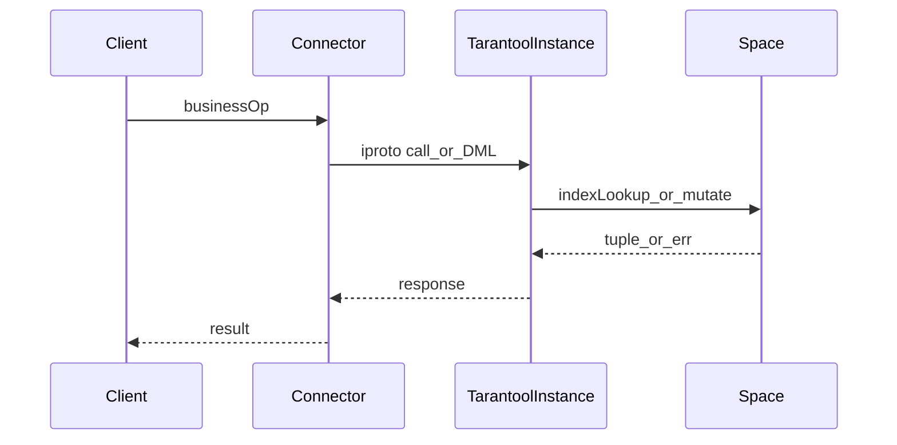

# Template: client request flow

```mermaid
sequenceDiagram
  participant Client
  participant Connector
  participant Instance as TarantoolInstance
  participant Space
  Client->>Connector: businessOp
  Connector->>Instance: iproto call_or_DML
  Instance->>Space: indexLookup_or_mutate
  Space-->>Instance: tuple_or_err
  Instance-->>Connector: response
  Connector-->>Client: result
```

For vshard, replace `Instance` with `Router` then `Storage` after bucket lookup.
