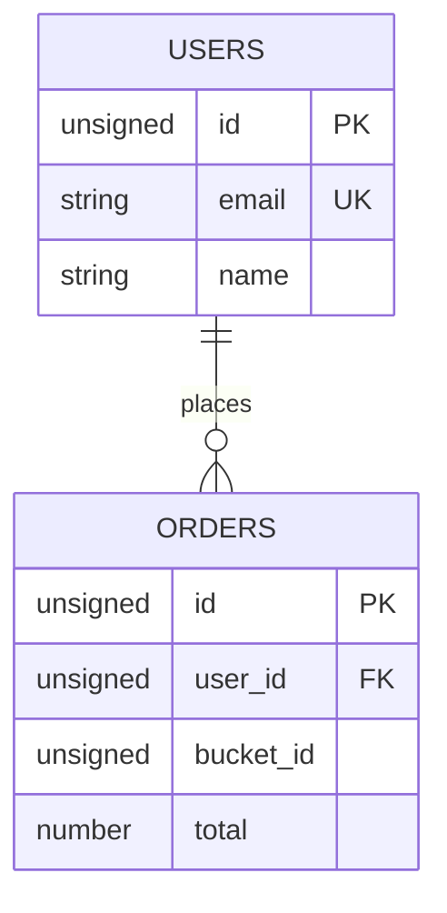

# Template: schema ER (spaces as entities)

Use field types from Tarantool formats (`unsigned`, `string`, `number`, `boolean`, `uuid`, `map`, `array`, …). Include `bucket_id` only for sharded spaces.
