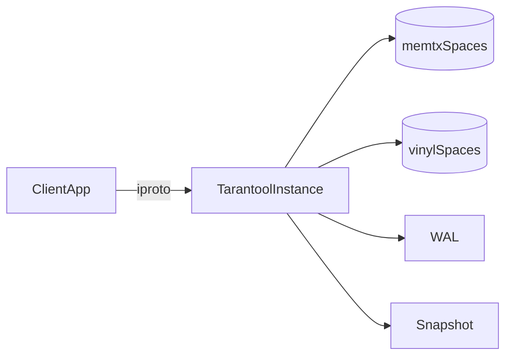

# Template: standalone instance

```mermaid
flowchart LR
  Client[ClientApp] -->|"iproto"| Instance[TarantoolInstance]
  Instance --> Memtx[(memtxSpaces)]
  Instance --> Vinyl[(vinylSpaces)]
  Instance --> WAL[WAL]
  Instance --> Snap[Snapshot]
```
