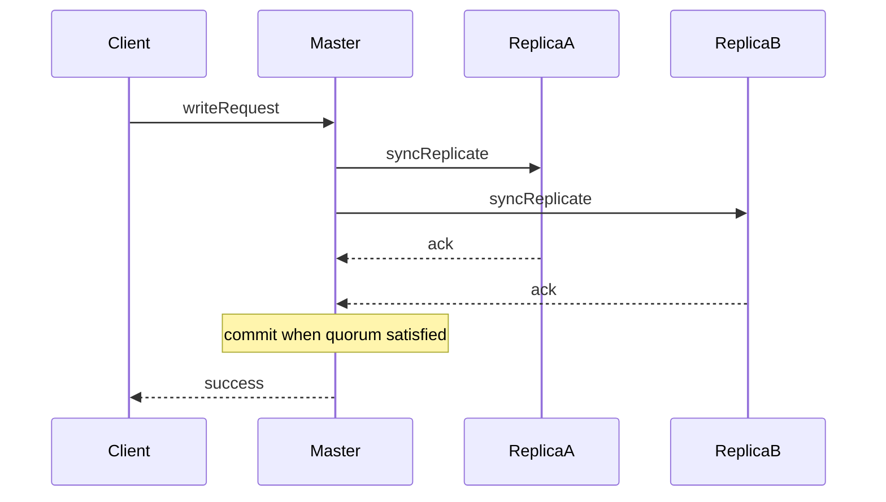

# Template: synchronous replication (quorum commit)

```mermaid
sequenceDiagram
  participant Client
  participant Master
  participant ReplicaA
  participant ReplicaB
  Client->>Master: writeRequest
  Master->>ReplicaA: syncReplicate
  Master->>ReplicaB: syncReplicate
  ReplicaA-->>Master: ack
  ReplicaB-->>Master: ack
  Note over Master: commit when quorum satisfied
  Master-->>Client: success
```
