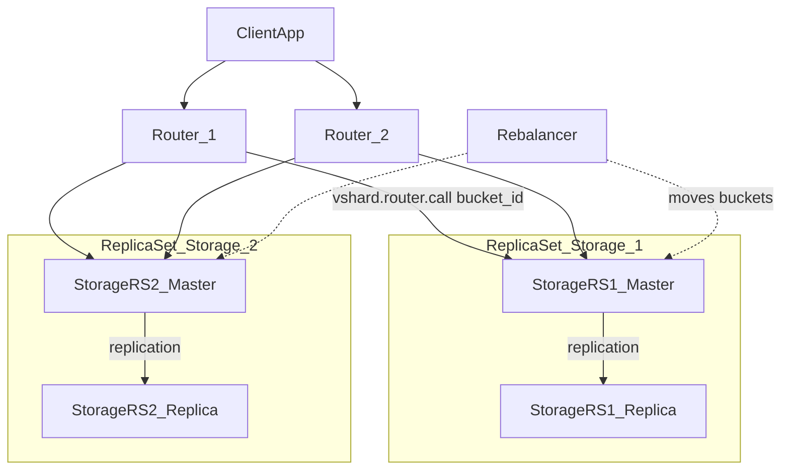

# Template: vshard cluster

```mermaid
flowchart TB
  Client[ClientApp] --> Router1[Router_1]
  Client --> Router2[Router_2]
  Router1 -->|"vshard.router.call bucket_id"| RS1Master[StorageRS1_Master]
  Router1 --> RS2Master[StorageRS2_Master]
  Router2 --> RS1Master
  Router2 --> RS2Master
  subgraph RS1[ReplicaSet_Storage_1]
    RS1Master -->|"replication"| RS1Replica[StorageRS1_Replica]
  end
  subgraph RS2[ReplicaSet_Storage_2]
    RS2Master -->|"replication"| RS2Replica[StorageRS2_Replica]
  end
  Rebalancer[Rebalancer] -.->|"moves buckets"| RS1Master
  Rebalancer -.-> RS2Master
```

Required callouts in prose: `bucket_count`, shard key → bucket function, each sharded space has `bucket_id`.
